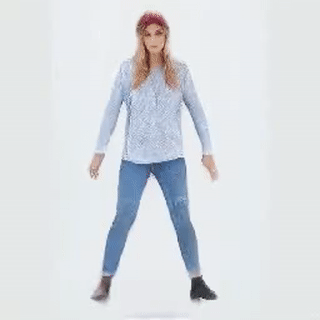
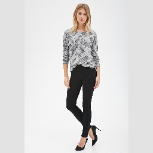
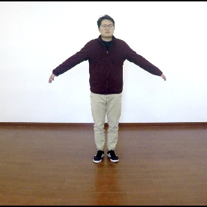
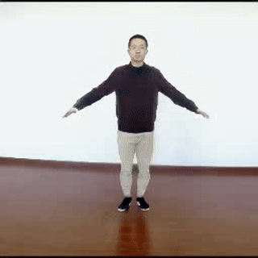
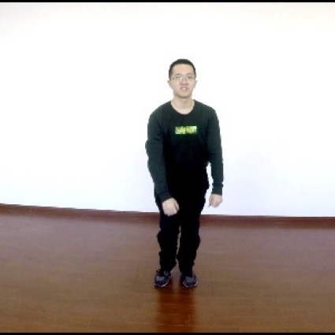
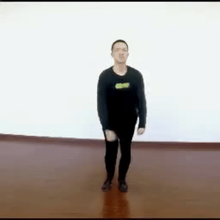
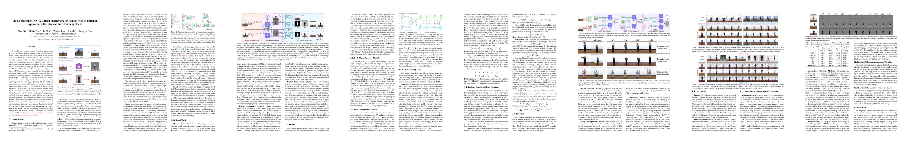

# Impersonator
PyTorch implementation of our ICCV 2019 paper:

Liquid Warping GAN: A Unified Framework for Human Motion Imitation, Appearance Transfer and Novel View Synthesis

**Please clone the newest codes.**

[[paper]](https://arxiv.org/pdf/1909.12224.pdf) [[website]](https://svip-lab.github.io/project/impersonator)

<p float="center">
	
  	
  	
	
	
    
        
  	
  	
	
	
    
</p>

## Getting Started
Python 3.6+, Pytorch 1.2, torchvision 0.4, and other requirements.
### Requirements
``` bash
pip install -r requirements.txt
```

### Installation
```shell
cd thirdparty/neural_renderer
python setup.py install
```

### Download resources.
1. Download `pretrains.zip` from [OneDrive](https://1drv.ms/u/s!AjjUqiJZsj8whLNw4QyntCMsDKQjSg?e=L77Elv) or
[BaiduPan](https://pan.baidu.com/s/11S7Z6Jj3WAfVNxBWyBjW6w) and then move the pretrains.zip to 
the `assets` directory and unzip this file.

2. Download `checkpoints.zip` from [OneDrive](https://1drv.ms/u/s!AjjUqiJZsj8whLNyoEh67Uu0LlxquA?e=dkOnhQ) or
[BaiduPan](https://pan.baidu.com/s/1snolk6wphbuHtQ_DeSA06Q) and then 
unzip the `checkpoints.zip` and move them to `outputs` directory.

3. Download `samples.zip` from [OneDrive](https://1drv.ms/u/s!AjjUqiJZsj8whLNz4BqnSgqrVwAXoQ?e=bC86db) or
[BaiduPan](https://pan.baidu.com/s/1xAI96709Gvqahq9uYAEXYA), and then
unzip the `samples.zip` and move them to `assets` directory.


### Running Demo
If you want to get the results of the demo shown in webpage, you can run the following scripts.
The results are saved in `./outputs/results/demos`

1. Demo of Motion Imitation
    ```bash
    python demo_imitator.py --gpu_ids 1
    ```
    
2. Demo of Appearance Transfer
    ```bash
    python demo_swap.py --gpu_ids 1
    ```

3. Demo of Novel View Synthesis
    ```bash
    python demo_view.py --gpu_ids 1
    ```


### Running Scripts (examples) (Details)
If you want to test other inputs (source image and reference images), here are some examples.
Please replace the `--ip YOUR_IP` and `--port YOUR_PORT` for 
[Visdom](https://github.com/facebookresearch/visdom) visualization. 

1. Motion Imitation
    * source image from iPER dataset
    ```bash
    python run_imitator.py --gpu_ids 0 --model imitator --output_dir ./outputs/results/  \
        --src_path      ./assets/src_imgs/imper_A_Pose/009_5_1_000.jpg    \
        --tgt_path      ./assets/samples/refs/iPER/024_8_2    \
        --bg_ks 13  --ft_ks 3 \
        --has_detector  --post_tune  \
        --save_res --ip YOUR_IP --port YOUR_PORT
    ```
        
    * source image from DeepFashion dataset
    ```bash
    python run_imitator.py --gpu_ids 0 --model imitator --output_dir ./outputs/results/  \
    --src_path      ./assets/src_imgs/fashion_woman/Sweaters-id_0000088807_4_full.jpg    \
    --tgt_path      ./assets/samples/refs/iPER/024_8_2    \
    --bg_ks 25  --ft_ks 3 \
    --has_detector  --post_tune  \
    --save_res --ip YOUR_IP --port YOUR_PORT
    ```
        
    * source image from Internet
    ```bash
    python run_imitator.py --gpu_ids 0 --model imitator --output_dir ./outputs/results/  \
        --src_path      ./assets/src_imgs/internet/men1_256.jpg    \
        --tgt_path      ./assets/samples/refs/iPER/024_8_2    \
        --bg_ks 7   --ft_ks 3 \
        --has_detector  --post_tune --front_warp \
        --save_res --ip YOUR_IP --port YOUR_PORT
    ```
2. Appearance Transfer

    An example that source image from iPER and reference image from DeepFashion dataset.

    ```bash
    python run_swap.py --gpu_ids 0 --model imitator --output_dir ./outputs/results/  \
        --src_path      ./assets/src_imgs/imper_A_Pose/024_8_2_0000.jpg    \
        --tgt_path      ./assets/src_imgs/fashion_man/Sweatshirts_Hoodies-id_0000680701_4_full.jpg    \
        --bg_ks 13  --ft_ks 3 \
        --has_detector  --post_tune  --front_warp --swap_part body  \
        --save_res --ip http://10.10.10.100 --port 31102
    ```
3. Novel View Synthesis
    ```bash
    python run_view.py --gpu_ids 0 --model viewer --output_dir ./outputs/results/  \
    --src_path      ./assets/src_imgs/internet/men1_256.jpg    \
    --bg_ks 13  --ft_ks 3 \
    --has_detector  --post_tune --front_warp --bg_replace \
    --save_res --ip http://10.10.10.100 --port 31102
    ```

The details of each running scripts are shown in [runDetails.md](doc/runDetails.md).
### Training from Scratch
The details are shown in [train.md](./doc/train.md) [TODO].

## Citation

```
@InProceedings{lwb2019,
    title={Liquid Warping GAN: A Unified Framework for Human Motion Imitation, Appearance Transfer and Novel View Synthesis},
    author={Wen Liu and Zhixin Piao, Min Jie, Wenhan Luo, Lin Ma and and Shenghua Gao},
    booktitle={The IEEE International Conference on Computer Vision (ICCV)},
    year={2019}
}
```
